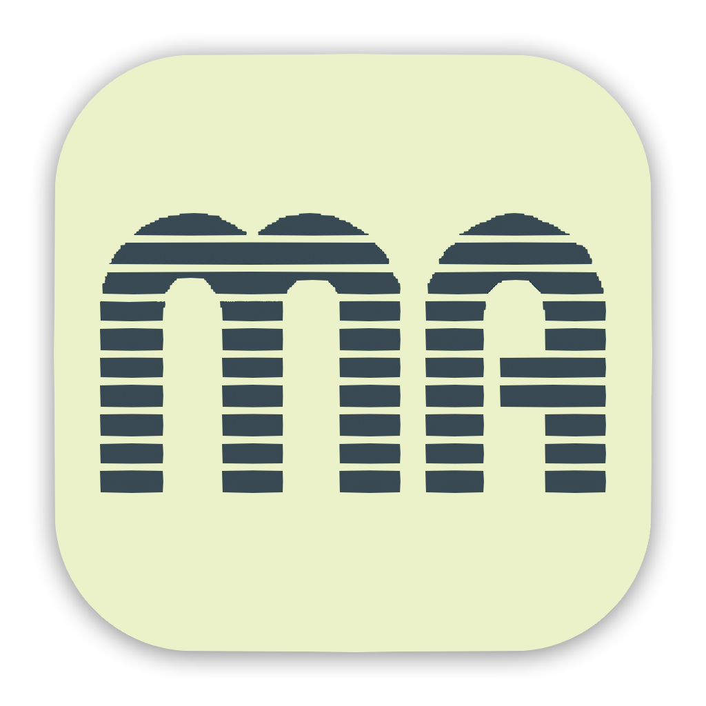
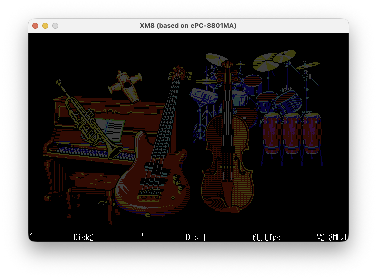

# XM8 for macOS

<p align="center">
  
</p>


NEC PC-8801のエミュレーターです。マルチプラットフォームです。


<p align="center">
  <a href="https://github.com/bubio/xm8mac/releases/latest">
    
  </a>
  <a href="https://github.com/bubio/xm8mac/blob/main/LICENSE">
    
  </a>
  <a href="https://github.com/bubio/xm8mac/releases/latest">
    
  </a>
</p>

## XM8 for macOSとは
---
XM8は、ＰＩ．さんが開発したマルチプラットフォーム（Windows/Linux/Android）に対応したPC-8801MA(PC-8801mkIISR上位互換)のエミュレータをmacOS用に改変したものです。

<p align="center">
  
</p>

このリポジトリは ＰＩ．さんから許可をいただき作成しています。

公式では配布されていないmacOS版の開発を主に行なっていきますが、Windows/Linux/Android版もできる限り配布します。

<br />

公式はこちらです。

http://retropc.net/pi/xm8/index.html


<br />

## インストール方法
---

[リリース](https://github.com/bubio/xm8mac/releases)からお手持ちの環境にあった実行ファイルをダウンロードしてください。

`XM8.app`を`アプリケーション`フォルダに移動するなどして実行してください。

<br />

### 動作環境

| CPU           | 最小OSバージョン    | 実行ファイル                                                 |
| ------------- | ------------------- | ------------------------------------------------------------ |
| x86_64        | macOS 10.13 High Sierra | [x86_64版](https://github.com/bubio/xm8mac/releases/download/1.7.8/XM8_macOS_Universal.dmg) |
| Apple Silicon | macOS 11 Big Sur    | [Apple Silicon版](https://github.com/bubio/xm8mac/releases/download/1.7.8/XM8_macOS_Universal.dmg) |

<br />

その他のOSはリリースを見てください。

<br />

## ROMファイル
---
使用できるROMファイルについては、[README-XM8.txt](Documents/README-XM8.txt)の[ROMファイル]を参照してください。

<br />

### 配置場所
ROMファイルの配置場所は、設定ファイルと同じ以下になります（一度、アプリケーションを起動するとフォルダが作成されます）。


```shell
"~/Library/Application Support/retro_pc_pi/xm8"
```


<br />

## 使用方法
---
[README-XM8.txt](Documents/README-XM8.txt)の[使い方]を参照してください。

### コマンドライン起動

Windows、macOS、Linux では、最大2個の D88 イメージをコマンドラインで指定できます。指定順にドライブ1、ドライブ2へ挿入されます。

```shell
xm8 [options] [--] [disk-spec ...]

xm8 game.d88
xm8 game.d88#1
xm8 system.d88#0 data.d88#1
xm8 --system V1H --clock 4MHz game.d88
```

`disk-spec` は `<path>`、`<path>#<bank>`、`<path>:<bank>` のいずれかです。bank は0始まりです。

オプション:

```text
--system <V1S|V1H|V2|N>
--clock <4|4MHz|8|8MHz|8H|8MHzH>
-h, --help
--version
```

`--system` と `--clock` はその起動中だけ有効で、通常の設定や自動保存 state には残りません。ファイル名の最後の要素に `#` または `:` を含むパスは bank 指定と曖昧になるため、コマンドラインでは指定できません。


<br />

## ビルド方法
---

### ビルド環境

ビルドするには以下のインストールが必要です。

- Xcode

  使うのはコマンドラインツールだけですが、Xcodeをインストールしてしまうのが手っ取り早いと思います。

- Homebrew
  
  [Homebrew](https://brew.sh/)のインストールが必要です。
  cmakeなどビルドに必要なツールの取得に使用します。

<br />

### ビルド手順

プロジェクトのルートをターミナルで開き、以下のコマンドを実行します。

```shell
cd Builder/macOS
./dist_app.sh
```

これでbuildフォルダに実行ファイル(.app)が作成されているはずです。

<br />

## 謝辞
---
ソースコードの改変を快諾してくださったＰＩ．氏にお礼申し上げます。


<br />

## その他のOS

---

### Windows版

----

Builder/WindowsフォルダにVisual Studio 2022用のソリューションが入っています。

<br />

Builder/Windowsフォルダにあるsetup_sdl2.ps1を実行すると、ビルドに必要なSDL2をダウンロードして適切な場所に配置します。

<br />

以下のようになります。

- Builder\Windows\SDL\include（インクルードファイル）
- Builder\Windows\SDL\lib\x86（x86向けライブラリ）
- Builder\Windows\SDL\lib\x64（x64向けライブラリ）
- Builder\Windows\SDL\lib\arm64（arm64向けライブラリ）

<br />

Builder/Windows/XM8.sln をVisual Studioでビルドします。
Builder/Windows/x64、Builder/Windows/Win32、Builder/Windows/ARM64に出力されます。実行に必要なのは、XM8.exeとSDL2.dllです。

BIOS ROMファイルの置き場所は以下になります。

```shell
%appdata%\retro_pc_pi\xm8
```


### Linux版

----

Builder/Linuxフォルダにdeb, rpm, appimageパッケージを作成するスクリプトが入っています。

ビルドに必要なライブラリは、dist_app.shを参照してください。

### deb or rpm
```shell
cd Builder/Linux
./dist_app.sh
```
これでbuildフォルダにdebファイル、またはrpmファイルが作成されます。

<br />

### appimage
```shell
cd Builder/Linux
./appimage.sh
```
これでBuilder/Linuxフォルダに、appimageファイルが作成されます。

<br />

BIOS ROMファイルの置き場所は以下になります。

```shell
~/.local/share/retro_pc_pi/xm8/
```


### Android版

----

Builder/AndroidフォルダにAndroid Studio用のプロジェクトが入っています。

<br />

Builder/Androidフォルダにあるsetup_sdl2.shを実行すると、ビルドに必要なSDL2をダウンロードして適切な場所に配置します。

<br />

以下のようになります。

- Builder/Android/app/jni/SDL\include（インクルードファイル）
- Builder/Android/app/jni/SDL\src（ソースファイル）
- Builder/Android/app/src/java/org/libsdl/app（Javaソースファイル）

<br />

Builder/AndroidをAndroid Studioで開いてビルドします。

<br />

BIOS ROMファイルの置き場所は以下になります。

```shell
Android/data/retro_pc_pi/files/
```

Android 11以上の場合、端末内のファイルに自由にアクセスすることができません。

ゲームのディスクイメージも同じ場所に入れることを推奨します。


## 使用しているOSSのライセンス

- xBRZ
  
  https://sourceforge.net/projects/xbrz/

  GNU General Public License version 3.0 (GPLv3)
